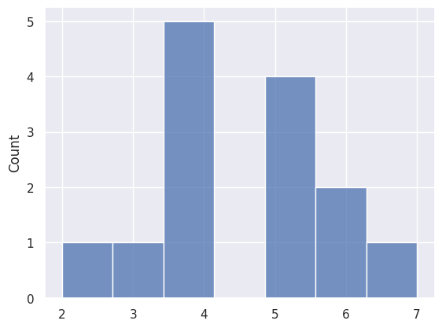
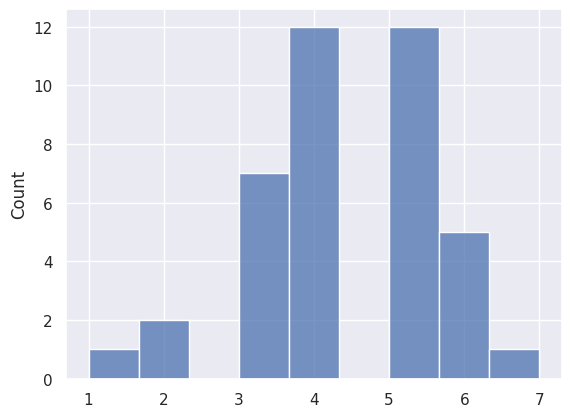
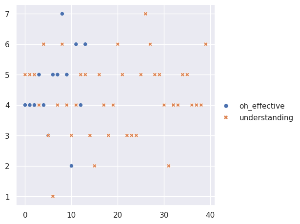
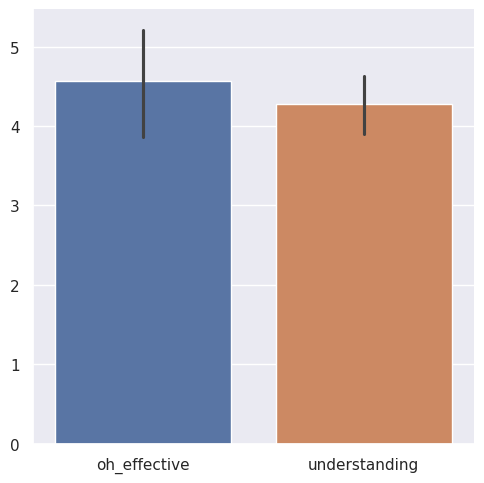

---
# Do not edit the text between these lines!
layout: default
---

# Analysis topic

1. Idea to analyze with available data: "The course should provide longer and more office hours sessions to help students with different schedules to better prepare for every quiz, especially during the final week."

2. This idea is more valuable than the others brainstormed because: It could greatly improve students' understanding on the class materials and assist them to perform their best during quiz. We can also use data from understanding and oh_effecive to analyze whether adding more sessions is helpful for students.

# First Histogram

<!--  -->

# Second Histogram

<!--  -->

# Scatterplot

<!--  -->

# Barplot

<!--  -->

<!-- This is a comment. Below, you'll see code for inserting an image. To make this image appear, update <custom-path>. To add an image, save it inside the imgs folder of this repository. -->

# Conclusion

Before generating the graphs, I hypothesized a strong positive correlation between the independent variable "understanding" and the dependent variable "oh_effective", as students with a better understanding of class materials will consider office hours helpful for them to study the topics taught in this course better. The first graph that I have created is a scattered plot, and I was hoping to discern a clear trend showing whether more people have picked oh_effective or understanding. However, the dots on the plot, with orange representing "understanding" and blue representing "oh_effective", were scattered around without a clear upward-sloping or downward-sloping line, and the only clear result was that significantly more people have rated "understanding" than "oh_effective".

For the second graph, I decided to generate a histogram to demonstrate the distributions of "understanding" and "oh_effective" in the survey results. The x-axis of the first graph shows ratings of "understanding" with the scale of 1 to 7, while the y-axis represents the number of people who have rated values shown on the x-axis. Similarly, the x-axis of the second graph shows ratings of "oh_effect" with the scale of 1 to 7, while the y-axis represents the number of people who have rated values shown on the x-axis. Again, for both variables, the majority of students responded an "understanding" level of approximately 4 or 5 out of 7, and an "oh_effective" score of 4 or 5 out of 7. Yet, the correlation between these two variables is relatively weak, as no clear trend on the graph could lead to a conclusion that people with higher "understanding" scores rated equally high "oh_effective" scores or people who rated lower "understanding" scores will also rate lower "oh_effective" scores.

I picked bar plots as my third graph, as I would like to develop a better understanding of the average ratings of these two scores. According to the plot, "oh_effective" shows a higher average rating closer to 5, while "understanding" has a relatively lower rating closer to 4. However, "oh_effective" has a greater error than the "understanding" a clear conclusion cannot be made about their relationships either. Therefore, the result cannot prove there is a strong positive correlation between "understanding" and "oh_effective", meaning that students' understanding of course topics is not directly influenced by whether they consider the office hours are effective.